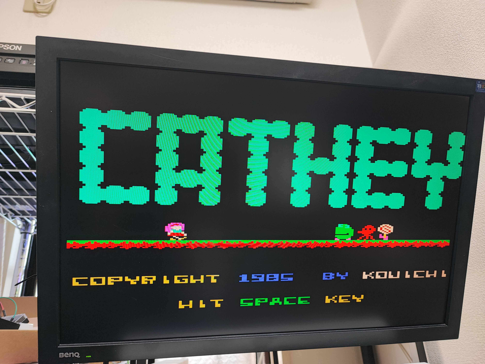
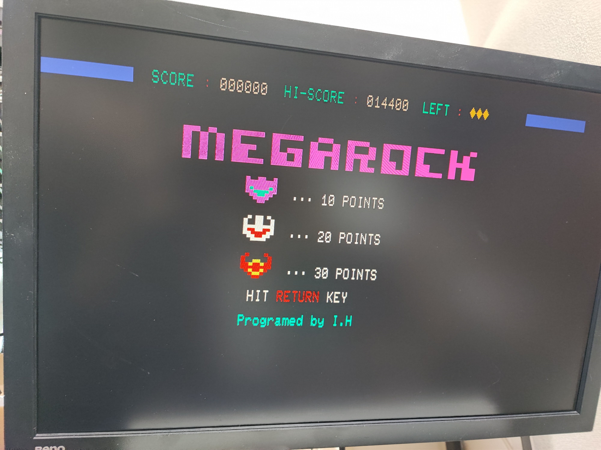
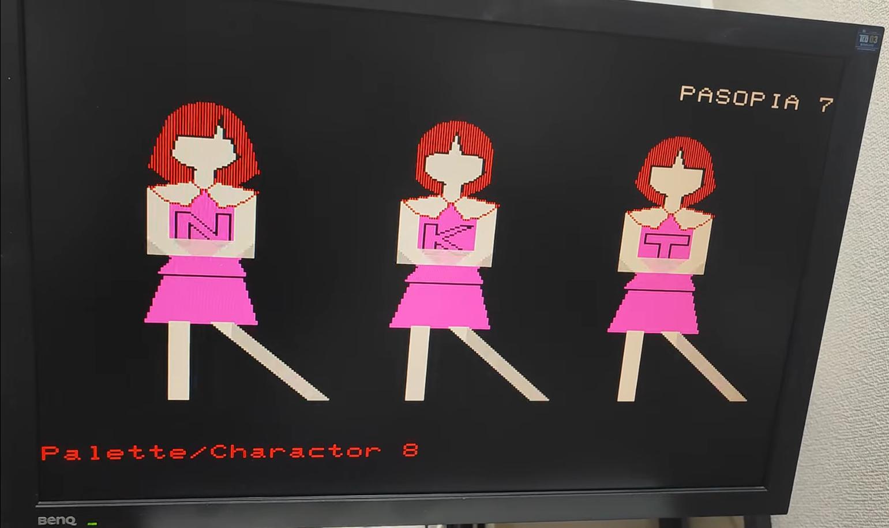

PC-8031 Emulator 偽8031
---
# Work in progress

現在作成中のため、ドキュメントも仮です。
未実装や実装予定にない機能ついて書かれている可能性があります。

---

# これはなに

PC-8001/8801 シリーズ用の 5インチフロッピードライブ、PC-8031 シリーズのエミュレータです。
PC-6001 シリーズでも動くと思います。

---
# 配線

今回はかなり複雑なので、


---
# ROM など

著作権の関係で ROM は含まれていません。

PC-80S31 (2KiB) および、PC-8801MA (8KiB) の disk.rom での動作を確認しています。

ROM ファイルを Pico に置きます。

picotool を使う場合は、以下の通りで行けると思います。
(picotool は pico-sdk に含まれています)

```
$ picotool load -v -x disk.rom -t bin -o 0x10070000
```

ROM を書き込んだのちに `prebuild` ディレクトリ以下にある uf2 ファイルを書き込むと起動します。

---
# 
---
# 制限事項

- フロッピーのフォーマット(しれっと無視します)
- FDC の一部のコマンドしか実装していないので、FDC を直接操作するソフトは動かない可能性があります。


---
# ライセンスなど

このエミュレータは以下のライブラリを使用しています。

- [Z80](https://github.com/redcode/Z80/tree/master)
- [Zeta](https://github.com/redcode/Zeta)


---
# Gallary

- パソピア



- パソピア7
